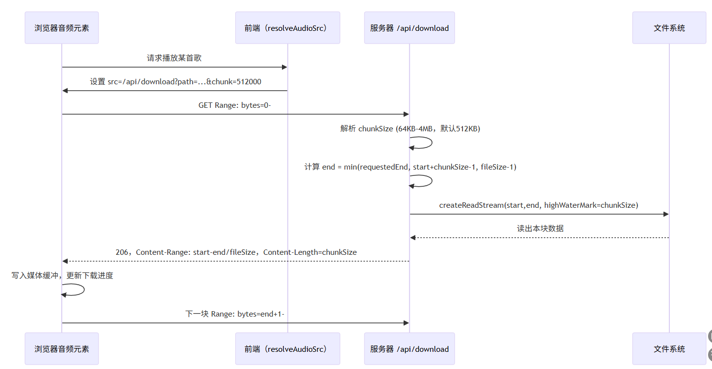
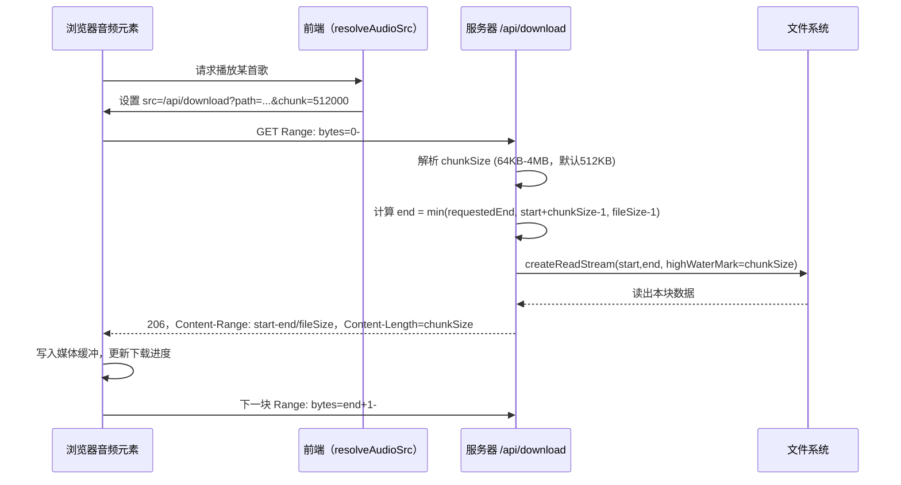

# Vue 3 + Vite

This template should help get you started developing with Vue 3 in Vite. The template uses Vue 3 `<script setup>` SFCs, check out the [script setup docs](https://v3.vuejs.org/api/sfc-script-setup.html#sfc-script-setup) to learn more.

Learn more about IDE Support for Vue in the [Vue Docs Scaling up Guide](https://vuejs.org/guide/scaling-up/tooling.html#ide-support).

# kid3
一个音频信息读取编辑工具，下载地址：https://kid3.kde.org/#download

## 切片下载流程（/api/download）

### 流程图

### 文字说明
- 前端播放服务器音频时，将 `audio.src` 指向 `/api/download?path=<相对路径>&chunk=<可选自定义大小>`。`chunk`/`chunkSize` 允许在 64KB–4MB 间调节单次响应大小，默认 512KB。
- 浏览器音频栈会自动发出带 `Range` 头的请求（如 `bytes=0-`）。服务器允许所有音频类型使用 Range。
- 服务器在 `handleDownload` 内：
  1. 解析 `chunkSize` 并夹在 64KB–4MB 之间。
  2. 从 Range 头取 `start` 与 `requestedEnd`，将 `end` 限制为 `start + chunkSize - 1` 且不超过文件末尾，确保返回块与 `Content-Range` 一致。
  3. 使用 `fs.createReadStream`，`highWaterMark` 与 chunkSize 同步，流式返回数据。
  4. 回应 `206 Partial Content`，附 `Content-Range: bytes start-end/size`、`Content-Length: chunkSize`、`Accept-Ranges: bytes`。
- 浏览器收到一块后写入缓冲（`audio.buffered`），播放推进时自动再发下一段 Range 请求，直到文件尾（或单次预加载完成时 `canplaythrough` 触发）。
- 对于非 Range 请求（极少数场景），服务器返回 200 全文件，并仍声明 `Accept-Ranges: bytes`，便于后续断点续传。
